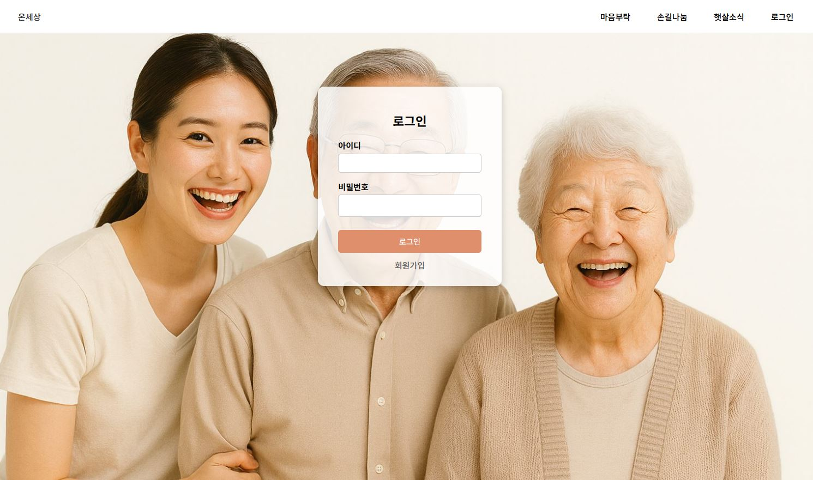
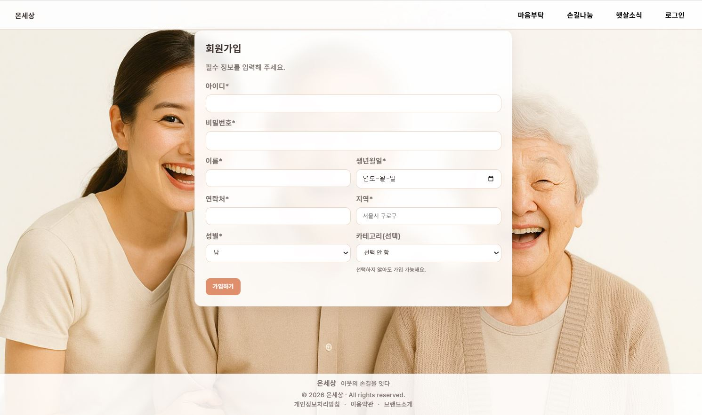
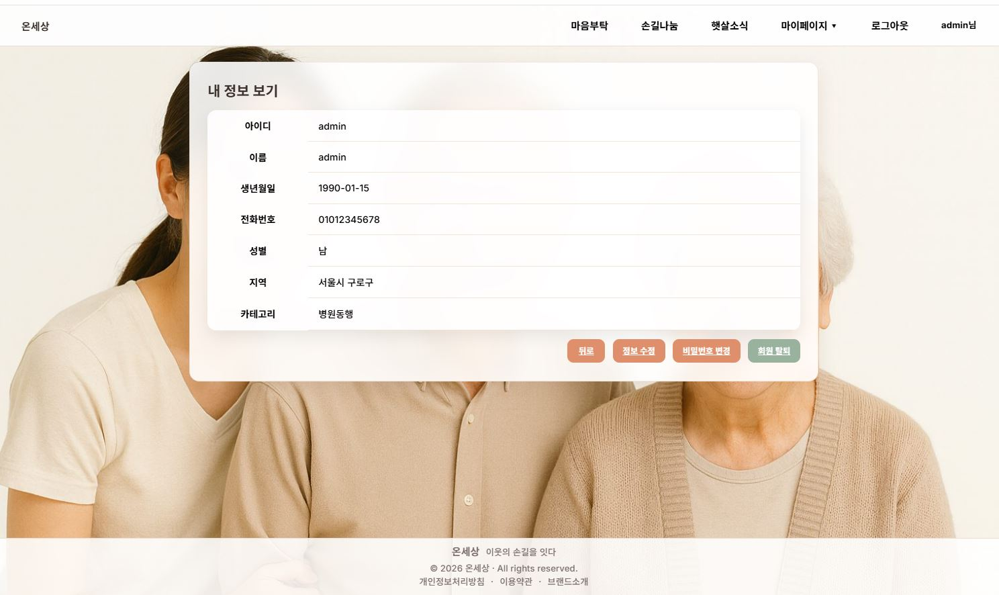
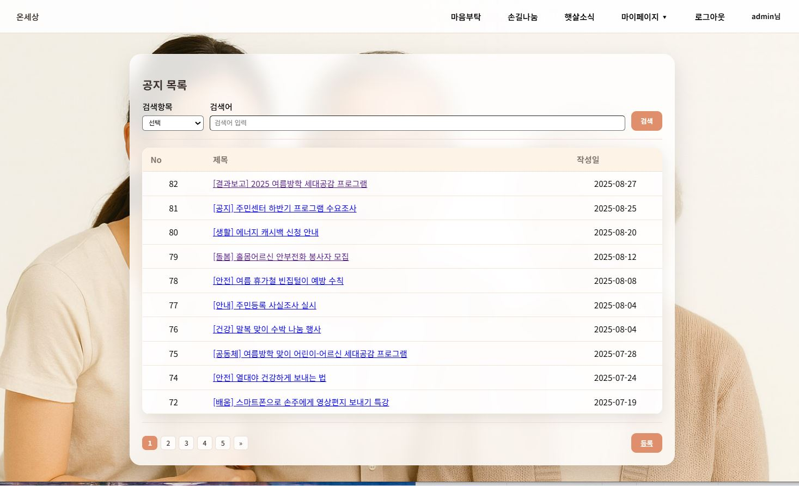
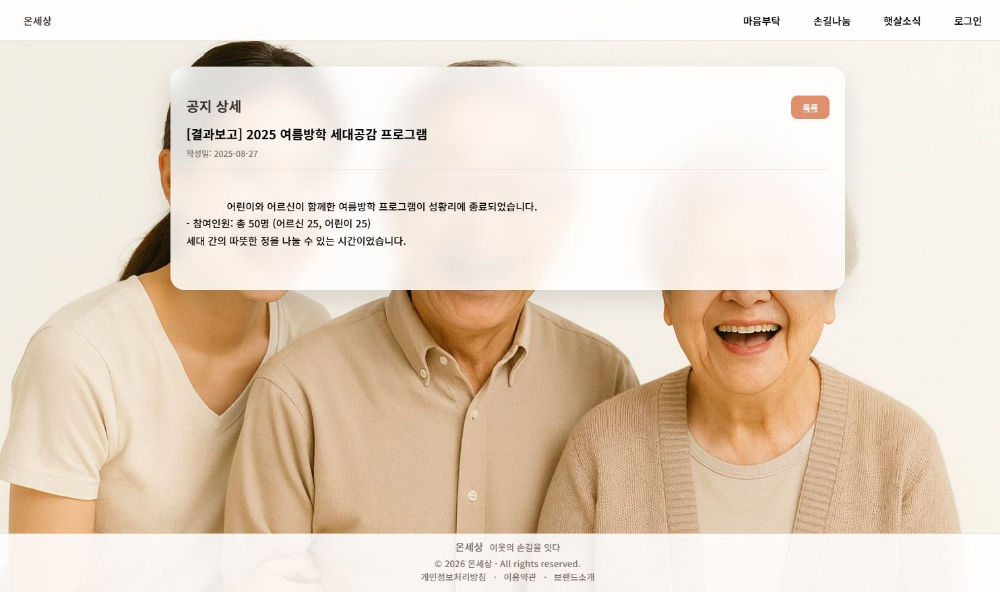
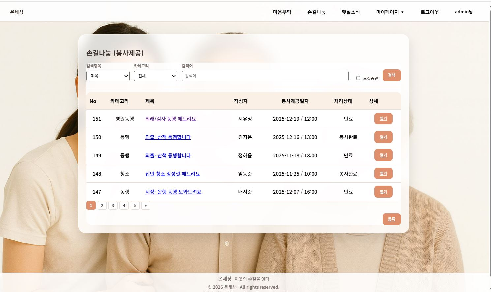
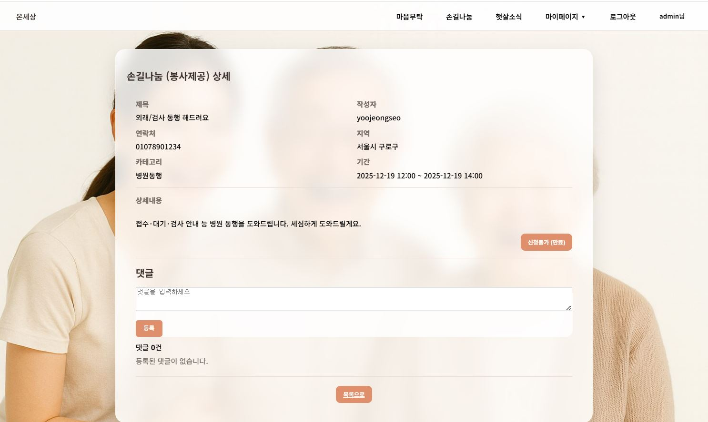
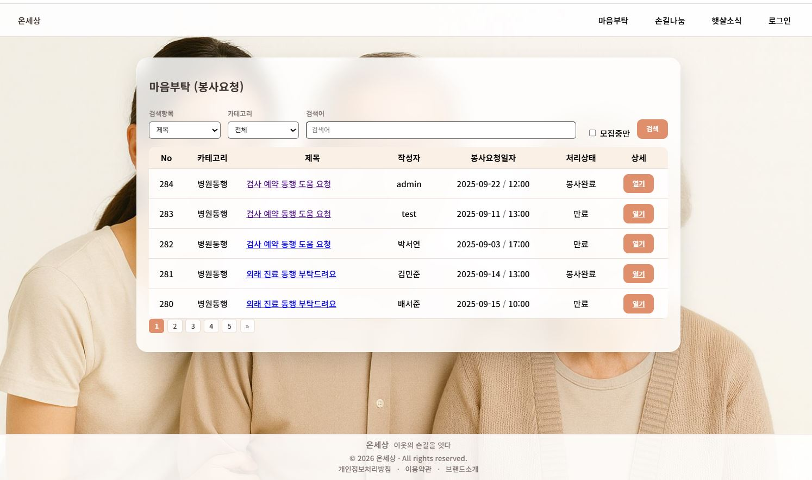
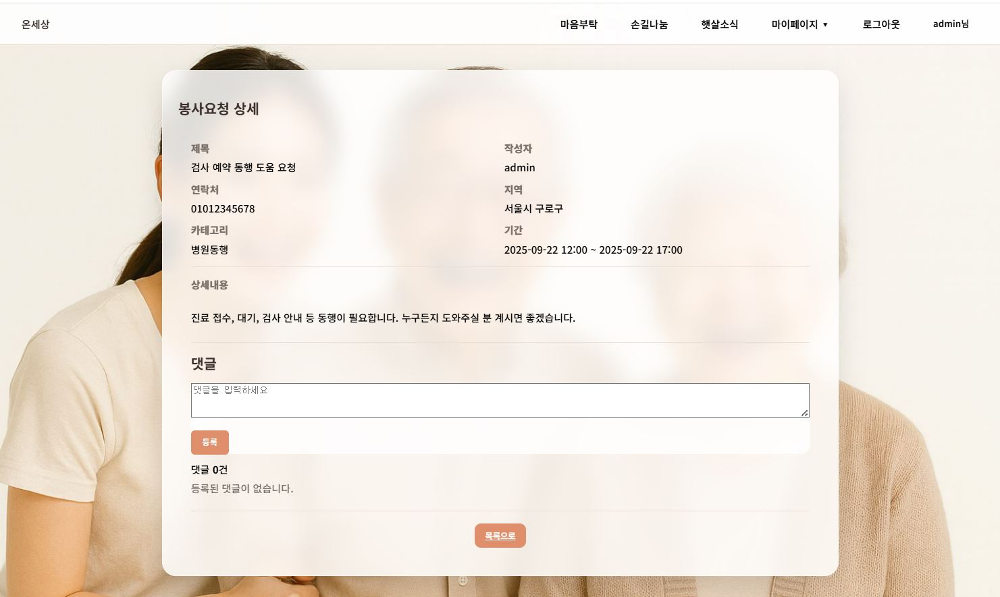

# OGIMS (온세상) - 자원봉사 매칭 플랫폼

> 취약계층과 자원봉사자를 연결하는 웹 기반 봉사활동 매칭 서비스


---

## 목차

1. [프로젝트 소개](#프로젝트-소개)
2. [기술 스택](#기술-스택)
3. [시스템 아키텍처](#시스템-아키텍처)
4. [ERD](#erd)
5. [프로젝트 구조](#프로젝트-구조)
6. [주요 기능](#주요-기능)
7. [URL 매핑](#url-매핑)
8. [핵심 기술 구현](#핵심-기술-구현)
9. [화면 구성](#화면-구성)
10. [실행 방법](#실행-방법)
11. [담당 역할](#담당-역할)

---

## 프로젝트 소개

**OGIMS (온세상)**는 자원봉사자와 도움이 필요한 취약계층을 연결하는 매칭 플랫폼입니다.

자원봉사자는 제공 가능한 봉사활동을 등록하고, 취약계층은 필요한 도움을 요청할 수 있습니다. 지역/카테고리 기반 검색과 댓글 시스템을 통해 효과적인 매칭이 이루어집니다.

### 주요 특징

- **봉사 매칭**: 봉사 제공(Offer)과 봉사 요청(Request) 양방향 매칭
- **지역 기반 검색**: 지역/카테고리별 필터링으로 근처 봉사활동 조회
- **실시간 댓글**: AJAX 기반 댓글 시스템으로 봉사자-신청자 간 소통
- **자동 상태 관리**: Quartz 스케줄러로 봉사 상태 자동 갱신 (10분 간격)
- **보안**: SHA-256 비밀번호 암호화, PreparedStatement SQL Injection 방지

---

## 기술 스택

### Backend

| 기술 | 버전 | 설명 |
|------|------|------|
| **Java** | 11 | 핵심 백엔드 언어 |
| **Servlet** | 4.0 | HTTP 요청/응답 처리 |
| **JSP/JSTL** | - | 서버 사이드 렌더링 |
| **JDBC** | - | 데이터베이스 연동 |
| **Quartz** | - | 배치 스케줄러 |

### Frontend

| 기술 | 설명 |
|------|------|
| **HTML5/CSS3** | 마크업 및 스타일링 |
| **JavaScript (ES6)** | 클라이언트 동적 기능 |
| **AJAX** | 비동기 댓글 처리 |

### Database & Server

| 기술 | 버전 | 설명 |
|------|------|------|
| **Oracle** | 11g XE | 관계형 데이터베이스 |
| **Apache Tomcat** | 9.0 | WAS |

### 개발 도구

| 도구 | 용도 |
|------|------|
| Eclipse IDE | 개발 환경 |
| Git | 버전 관리 |
| SQL Developer | DB 관리 |

---

## 시스템 아키텍처

```
┌─────────────────────────────────────────────────────────────────────┐
│                          Client (Browser)                            │
│                       HTML + CSS + JavaScript                        │
│                           AJAX (댓글)                                │
└─────────────────────────────────────────────────────────────────────┘
                                   │
                                   ▼
┌─────────────────────────────────────────────────────────────────────┐
│                          Apache Tomcat 9.0                           │
│  ┌────────────────────────────────────────────────────────────────┐ │
│  │                      RequestFilter                              │ │
│  │                   (UTF-8 인코딩 처리)                           │ │
│  └────────────────────────────────────────────────────────────────┘ │
│                                   │                                  │
│  ┌────────────────────────────────────────────────────────────────┐ │
│  │                ActionServlet (Front Controller)                 │ │
│  │                   *.do 요청 → Action 매핑                       │ │
│  └────────────────────────────────────────────────────────────────┘ │
│                                   │                                  │
│  ┌────────────────────────────────────────────────────────────────┐ │
│  │                       Action Layer                              │ │
│  │   UserAction    VolOfferAction    VolRequestAction    etc.     │ │
│  └────────────────────────────────────────────────────────────────┘ │
│                                   │                                  │
│  ┌────────────────────────────────────────────────────────────────┐ │
│  │                      Service Layer                              │ │
│  │  UserServiceImpl  VolOfferServiceImpl  VolRequestServiceImpl   │ │
│  └────────────────────────────────────────────────────────────────┘ │
│                                   │                                  │
│  ┌────────────────────────────────────────────────────────────────┐ │
│  │                        DAO Layer                                │ │
│  │     UserDao        VolOfferDao        VolRequestDao             │ │
│  │              (JDBC + PreparedStatement)                         │ │
│  └────────────────────────────────────────────────────────────────┘ │
│                                   │                                  │
│  ┌────────────────────────────────────────────────────────────────┐ │
│  │                    Quartz Scheduler                             │ │
│  │           VolRequestStatusJob (10분마다 상태 갱신)              │ │
│  └────────────────────────────────────────────────────────────────┘ │
└─────────────────────────────────────────────────────────────────────┘
                                   │
                                   ▼
┌─────────────────────────────────────────────────────────────────────┐
│                        Oracle Database 11g XE                        │
│              USERS / VOLUNTEER / COMMENTS / NOTICE                   │
└─────────────────────────────────────────────────────────────────────┘
```

---

## ERD

```
┌──────────────────┐         ┌──────────────────────────┐
│      USERS       │         │        VOLUNTEER         │
├──────────────────┤         ├──────────────────────────┤
│ USERID (PK)      │◄───┐    │ VOLUNTEERID (PK)         │
│ PASSWORD         │    │    │ AUTHORID (FK) ───────────┼───┐
│ NAME             │    │    │ TITLE                    │   │
│ REGION           │    │    │ CONTENT                  │   │
│ PHONE            │    │    │ PHONE                    │   │
│ GENDER           │    │    │ REGION                   │   │
│ BIRTHDATE        │    │    │ CATEGORY                 │   │
│ CATEGORY         │    │    │ STARTTIME                │   │
│ STATUS (Y/N)     │    │    │ ENDTIME                  │   │
└──────────────────┘    │    │ STATUS                   │   │
        ▲               │    │ FLAG (o=제공, r=요청)    │   │
        │               │    │ IMAGE                    │   │
        │               │    │ CREATEDAT                │   │
        │               │    └──────────────────────────┘   │
        │               │                 ▲                 │
        │               │                 │                 │
        │               └─────────────────┼─────────────────┘
        │                                 │
        │    ┌────────────────────────────┼────────────────────────┐
        │    │                            │                        │
        │    │                            │                        │
┌───────┴────┴───────┐         ┌──────────┴─────────┐
│      NOTICE        │         │      COMMENTS      │
├────────────────────┤         ├────────────────────┤
│ NOTICEID (PK)      │         │ COMMENTID (PK)     │
│ AUTHORID (FK)      │         │ VOLUNTEERID (FK)   │
│ TITLE              │         │ AUTHORID (FK)      │
│ CONTENT            │         │ CONTENT            │
│ CREATEDAT          │         │ CREATEDAT          │
└────────────────────┘         └────────────────────┘
```

### 테이블 설명

| 테이블 | 설명 |
|--------|------|
| **USERS** | 회원 정보 (봉사자/요청자/관리자) |
| **VOLUNTEER** | 봉사 제공/요청 게시글 (FLAG로 구분) |
| **COMMENTS** | 게시글 댓글 |
| **NOTICE** | 공지사항 (관리자 전용) |

### 봉사 상태 값

| STATUS | 설명 |
|--------|------|
| 모집중 | 봉사자/요청자 모집 중 |
| 모집완료 | 매칭 완료 |
| 만료 | 모집중 상태에서 종료일 경과 |
| 봉사완료 | 모집완료 상태에서 종료일 경과 |

---

## 프로젝트 구조

```
src/main/java/com/semi/
├── domain/                         # 도메인 모델 (Entity)
│   ├── User.java                   # 사용자
│   ├── Post.java                   # 게시글 추상 클래스
│   ├── VolOffer.java               # 봉사 제공 (extends Post)
│   ├── VolRequest.java             # 봉사 요청 (extends Post)
│   ├── Notice.java                 # 공지사항
│   └── Comment.java                # 댓글
│
├── framework/                      # MVC 프레임워크
│   ├── ActionServlet.java          # Front Controller (*.do)
│   ├── Action.java                 # Action 추상 클래스
│   └── RequestMapping.java         # URL-Action 매핑
│
├── view/                           # Controller (Action)
│   ├── user/                       # 회원 관련 (12개 Action)
│   │   ├── LoginAction.java
│   │   ├── LogoutAction.java
│   │   ├── AddUserAction.java
│   │   ├── UpdateUserAction.java
│   │   ├── DeleteAccAction.java
│   │   └── ...
│   ├── volOffer/                   # 봉사 제공 (7개 Action)
│   │   ├── ListVolOfferAction.java
│   │   ├── AddVolOfferAction.java
│   │   ├── DetailVolOfferAction.java
│   │   ├── UpdateVolOfferAction.java
│   │   ├── DeleteVolOfferAction.java
│   │   └── ProcessVolOfferAction.java
│   ├── volRequest/                 # 봉사 요청 (7개 Action)
│   ├── notice/                     # 공지사항 (7개 Action)
│   └── comment/                    # 댓글 (4개 Action)
│       ├── AddCommentAction.java
│       ├── UpdateCommentAction.java
│       ├── DeleteCommentAction.java
│       └── ListCommentAction.java
│
├── service/                        # Business Logic
│   ├── user/
│   │   ├── UserService.java
│   │   └── UserServiceImpl.java
│   ├── volOffer/
│   │   ├── VolOfferService.java
│   │   └── VolOfferServiceImpl.java
│   ├── volRequest/
│   ├── notice/
│   └── comment/
│
├── dao/                            # Data Access (JDBC)
│   ├── user/UserDao.java
│   ├── volOffer/VolOfferDao.java
│   ├── volRequest/VolRequestDao.java
│   ├── notice/NoticeDao.java
│   └── comment/CommentDao.java
│
├── common/                         # 공통 유틸리티
│   ├── util/
│   │   ├── DBUtil.java             # DB 커넥션 관리
│   │   ├── PasswordUtilSHA256.java # 비밀번호 암호화
│   │   ├── HttpUtil.java           # Forward/Redirect
│   │   ├── FileUtil.java           # 파일 업로드
│   │   └── CommonUtil.java
│   ├── Page.java                   # 페이징 정보
│   ├── Search.java                 # 검색 조건
│   └── filter/
│       └── RequestFilter.java      # UTF-8 인코딩 필터
│
└── batch/                          # 배치 작업
    ├── QuartzBootListener.java     # 스케줄러 초기화
    └── VolRequestStatusJob.java    # 10분마다 상태 자동 갱신

src/main/webapp/
├── index.jsp                       # 메인 페이지
├── common/
│   ├── layout.jsp                  # 전체 레이아웃
│   ├── top.jspf                    # 상단 네비게이션
│   ├── footer.jspf                 # 하단
│   └── pageNavigator.jsp           # 페이징
├── user/                           # 회원 화면
├── volOffer/                       # 봉사 제공 화면
├── volRequest/                     # 봉사 요청 화면
├── notice/                         # 공지사항 화면
├── comment/                        # 댓글 (AJAX Fragment)
├── policy/                         # 서비스 정책
├── css/                            # 스타일시트
├── js/                             # JavaScript
└── images/                         # 업로드 이미지
```

---

## 주요 기능

### 1. 회원 관리

| 기능 | 설명 |
|------|------|
| 회원가입 | 아이디 중복 확인, SHA-256 비밀번호 암호화 |
| 로그인/로그아웃 | 세션 기반 인증 |
| 회원정보 조회 | 본인 프로필 확인 |
| 회원정보 수정 | 이름, 지역, 연락처 등 |
| 비밀번호 변경 | 기존 비밀번호 확인 후 변경 |
| 회원 탈퇴 | 비밀번호 확인 후 상태 비활성화 (status='N') |

### 2. 봉사 제공 (VolOffer)

| 기능 | 설명 |
|------|------|
| 봉사 제공 등록 | 제목, 내용, 지역, 카테고리, 기간, 이미지 |
| 목록 조회 | 검색(제목/지역/작성자/날짜) + 필터(카테고리/상태/지역) + 페이징 |
| 상세 조회 | 봉사 정보 + 댓글 목록 |
| 수정/삭제 | 작성자 본인만 가능 |
| 상태 변경 | 모집중 → 모집완료 |

### 3. 봉사 요청 (VolRequest)

| 기능 | 설명 |
|------|------|
| 봉사 요청 등록 | 도움이 필요한 내용 등록 |
| 목록/상세/수정/삭제 | 봉사 제공과 동일 구조 |
| 상태 변경 | 모집중 → 모집완료 |

### 4. 댓글 (AJAX)

| 기능 | 설명 |
|------|------|
| 댓글 등록 | 비동기 등록 (페이지 새로고침 없음) |
| 댓글 수정 | 본인 댓글만 수정 가능 |
| 댓글 삭제 | 본인 댓글만 삭제 가능 |
| 댓글 목록 | 페이지네이션 지원 |

### 5. 공지사항 (관리자)

| 기능 | 설명 |
|------|------|
| 공지 등록 | 관리자만 가능 |
| 목록 조회 | 모든 사용자 조회 가능 (검색/페이징) |
| 수정/삭제 | 관리자만 가능 |

### 6. 자동 상태 관리 (Quartz)

| 조건 | 변경 |
|------|------|
| 상태='모집중' + 종료일 < 현재 | → '만료' |
| 상태='모집완료' + 종료일 < 현재 | → '봉사완료' |

- **실행 주기**: 10분마다 자동 실행
- **트랜잭션**: 자동커밋 OFF, 에러 시 롤백

---

## URL 매핑

### 회원 (User)

| URL | Action | 설명 |
|-----|--------|------|
| `/addUserView.do` | AddUserViewAction | 회원가입 폼 |
| `/addUser.do` | AddUserAction | 회원가입 처리 |
| `/loginView.do` | LoginViewAction | 로그인 폼 |
| `/login.do` | LoginAction | 로그인 처리 |
| `/logout.do` | LogoutAction | 로그아웃 |
| `/detailUser.do` | DetailUserAction | 회원정보 조회 |
| `/updateUserView.do` | UpdateUserViewAction | 수정 폼 |
| `/updateUser.do` | UpdateUserAction | 수정 처리 |
| `/updatePwdView.do` | UpdatePwdViewAction | 비밀번호 변경 폼 |
| `/updatePwd.do` | UpdatePwdAction | 비밀번호 변경 처리 |
| `/deleteAccView.do` | DeleteAccViewAction | 탈퇴 확인 폼 |
| `/deleteAcc.do` | DeleteAccAction | 탈퇴 처리 |

### 봉사 제공 (VolOffer)

| URL | Action | 설명 |
|-----|--------|------|
| `/listVolOffer.do` | ListVolOfferAction | 목록 조회 |
| `/addVolOfferView.do` | AddVolOfferViewAction | 등록 폼 |
| `/addVolOffer.do` | AddVolOfferAction | 등록 처리 |
| `/detailVolOffer.do` | DetailVolOfferAction | 상세 조회 |
| `/updateVolOfferView.do` | UpdateVolOfferViewAction | 수정 폼 |
| `/updateVolOffer.do` | UpdateVolOfferAction | 수정 처리 |
| `/deleteVolOffer.do` | DeleteVolOfferAction | 삭제 처리 |
| `/processVolOffer.do` | ProcessVolOfferAction | 상태 변경 |

### 봉사 요청 (VolRequest)

| URL | Action | 설명 |
|-----|--------|------|
| `/listVolRequest.do` | ListVolRequestAction | 목록 조회 |
| `/addVolRequest.do` | AddVolRequestAction | 등록 처리 |
| `/detailVolRequest.do` | DetailVolRequestAction | 상세 조회 |
| `/updateVolRequest.do` | UpdateVolRequestAction | 수정 처리 |
| `/deleteVolRequest.do` | DeleteVolRequestAction | 삭제 처리 |

### 댓글 (Comment) - AJAX

| URL | Action | 설명 |
|-----|--------|------|
| `/addComment.do` | AddCommentAction | 댓글 등록 |
| `/updateComment.do` | UpdateCommentAction | 댓글 수정 |
| `/deleteComment.do` | DeleteCommentAction | 댓글 삭제 |
| `/listComment.do` | ListCommentAction | 댓글 목록 |

### 공지사항 (Notice)

| URL | Action | 설명 |
|-----|--------|------|
| `/listNotice.do` | ListNoticeAction | 목록 조회 |
| `/addNotice.do` | AddNoticeAction | 등록 처리 |
| `/detailNotice.do` | DetailNoticeAction | 상세 조회 |
| `/updateNotice.do` | UpdateNoticeAction | 수정 처리 |
| `/deleteNotice.do` | DeleteNoticeAction | 삭제 처리 |

---

## 핵심 기술 구현

### 1. Front Controller 패턴 (ActionServlet)

```java
@WebServlet("*.do")
public class ActionServlet extends HttpServlet {

    private RequestMapping requestMapping;

    @Override
    public void init() throws ServletException {
        String mappingFile = getInitParameter("actionmapping");
        requestMapping = new RequestMapping(mappingFile);
    }

    @Override
    protected void service(HttpServletRequest request, HttpServletResponse response)
            throws ServletException, IOException {

        String uri = request.getRequestURI();
        String contextPath = request.getContextPath();
        String path = uri.substring(contextPath.length());

        // URL → Action 매핑
        Action action = requestMapping.getAction(path);

        // Action 실행
        String result = action.execute(request, response);

        // 결과 처리
        if (result != null) {
            if (result.startsWith("redirect:")) {
                HttpUtil.redirect(response, result.substring(9));
            } else if (result.startsWith("forward:")) {
                HttpUtil.forward(request, response, result.substring(8));
            }
        }
    }
}
```

### 2. SHA-256 비밀번호 암호화

```java
public class PasswordUtilSHA256 {

    public static String hash(String plain) {
        try {
            MessageDigest md = MessageDigest.getInstance("SHA-256");
            byte[] hashBytes = md.digest(plain.getBytes(StandardCharsets.UTF_8));

            StringBuilder sb = new StringBuilder();
            for (byte b : hashBytes) {
                sb.append(String.format("%02x", b));
            }
            return sb.toString();
        } catch (NoSuchAlgorithmException e) {
            throw new RuntimeException("SHA-256 not available", e);
        }
    }

    public static boolean matches(String plain, String hashed) {
        return hash(plain).equals(hashed);
    }
}
```

### 3. AJAX 댓글 처리

```java
// AddCommentAction.java
public class AddCommentAction extends Action {

    @Override
    public String execute(HttpServletRequest request, HttpServletResponse response)
            throws Exception {

        // 로그인 체크
        User loginUser = (User) request.getSession().getAttribute("loginUser");
        if (loginUser == null) {
            response.setStatus(HttpServletResponse.SC_UNAUTHORIZED);
            response.setContentType("application/json;charset=UTF-8");
            response.getWriter().write("{\"success\":false,\"message\":\"로그인이 필요합니다.\"}");
            return null;
        }

        // 댓글 등록
        long volunteerId = Long.parseLong(request.getParameter("volunteerId"));
        String content = request.getParameter("content");

        Comment comment = new Comment();
        comment.setVolunteerId(volunteerId);
        comment.setAuthorId(loginUser.getUserId());
        comment.setContent(content);

        commentService.addComment(comment);

        // JSON 응답
        response.setContentType("application/json;charset=UTF-8");
        response.getWriter().write("{\"success\":true}");
        return null;
    }
}
```

### 4. Quartz 배치 스케줄러

```java
// VolRequestStatusJob.java
public class VolRequestStatusJob implements Job {

    @Override
    public void execute(JobExecutionContext context) {
        Connection con = null;
        try {
            con = DBUtil.getConnection();
            con.setAutoCommit(false);

            // 모집중 → 만료 (종료일 경과)
            String sql1 = "UPDATE volunteer SET status = '만료' " +
                          "WHERE endtime < SYSDATE AND status = '모집중'";
            int expired = executeUpdate(con, sql1);

            // 모집완료 → 봉사완료 (종료일 경과)
            String sql2 = "UPDATE volunteer SET status = '봉사완료' " +
                          "WHERE endtime < SYSDATE AND status = '모집완료'";
            int completed = executeUpdate(con, sql2);

            con.commit();
            System.out.println("[VolRequestStatusJob] 만료: " + expired + "건, 봉사완료: " + completed + "건");

        } catch (Exception e) {
            if (con != null) try { con.rollback(); } catch (SQLException ignored) {}
            e.printStackTrace();
        } finally {
            DBUtil.close(con);
        }
    }
}

// QuartzBootListener.java - 10분마다 실행
Trigger trigger = TriggerBuilder.newTrigger()
    .withSchedule(SimpleScheduleBuilder.simpleSchedule()
        .withIntervalInMinutes(10)
        .repeatForever())
    .build();
```

### 5. 동적 검색 쿼리 (DAO)

```java
// VolOfferDao.java
public List<VolOfferListItem> getVolOfferList(Search search, String category,
        int pageUnit, String status, String regionLock) {

    StringBuilder sql = new StringBuilder();
    sql.append("SELECT * FROM (");
    sql.append("  SELECT v.*, u.name AS authorName, ");
    sql.append("         ROW_NUMBER() OVER (ORDER BY v.createdat DESC) AS rnum ");
    sql.append("  FROM volunteer v ");
    sql.append("  JOIN users u ON v.authorid = u.userid ");
    sql.append("  WHERE v.flag = 'o' ");

    // 동적 조건 추가
    if (category != null && !category.isEmpty()) {
        sql.append(" AND v.category = ? ");
    }
    if (status != null && !status.isEmpty()) {
        sql.append(" AND v.status = ? ");
    }
    if (regionLock != null && !regionLock.isEmpty()) {
        sql.append(" AND v.region LIKE ? ");
    }

    // 검색 조건
    String condition = search.getSearchCondition();
    String keyword = search.getSearchKeyword();
    if (condition != null && keyword != null && !keyword.isEmpty()) {
        switch (condition) {
            case "title":
                sql.append(" AND v.title LIKE ? ");
                break;
            case "region":
                sql.append(" AND v.region LIKE ? ");
                break;
            case "author":
                sql.append(" AND u.name LIKE ? ");
                break;
        }
    }

    sql.append(") WHERE rnum BETWEEN ? AND ?");

    // PreparedStatement 실행...
}
```

### 6. 파일 업로드

```java
// FileUtil.java
public class FileUtil {

    public static String saveImage(Part imagePart, ServletContext ctx) throws IOException {
        if (imagePart == null || imagePart.getSize() == 0) {
            return null;
        }

        String originalName = imagePart.getSubmittedFileName();
        String extension = originalName.substring(originalName.lastIndexOf("."));
        String savedName = UUID.randomUUID().toString() + extension;

        String uploadPath = ctx.getRealPath("/images");
        File uploadDir = new File(uploadPath);
        if (!uploadDir.exists()) {
            uploadDir.mkdirs();
        }

        imagePart.write(uploadPath + File.separator + savedName);
        return savedName;
    }
}
```

---

## 화면 구성

| 페이지 | 파일 | 설명 |
|--------|------|------|
| **메인** | index.jsp | 홈페이지 |
| **로그인** | user/loginView.jsp | 로그인 폼 |
| **회원가입** | user/addUserView.jsp | 회원정보 입력 |
| **마이페이지** | user/detailUserView.jsp | 회원정보 조회 |
| **봉사 제공 목록** | volOffer/listVolOffer.jsp | 검색/필터/페이징 |
| **봉사 제공 상세** | volOffer/detailVolOffer.jsp | 상세 + 댓글 |
| **봉사 제공 등록** | volOffer/addVolOffer.jsp | 등록 폼 |
| **봉사 요청 목록** | volRequest/listVolRequest.jsp | 검색/필터/페이징 |
| **봉사 요청 상세** | volRequest/detailVolRequest.jsp | 상세 + 댓글 |
| **공지사항 목록** | notice/listNoticeView.jsp | 공지 목록 |
| **공지사항 상세** | notice/detailViewNotice.jsp | 공지 내용 |
| **서비스 소개** | policy/about.jsp | 서비스 설명 |
| **이용약관** | policy/terms.jsp | 약관 |
| **개인정보처리방침** | policy/privacy.jsp | 개인정보 정책 |

### 스크린샷

| 로그인 | 회원가입 |
|:------:|:--------:|
|  |  |

| 마이페이지 | 공지사항 목록 |
|:----------:|:-------------:|
|  |  |

| 공지사항 상세 | 봉사 제공 목록 |
|:-------------:|:--------------:|
|  |  |

| 봉사 제공 상세 | 봉사 요청 목록 |
|:--------------:|:--------------:|
|  |  |

| 봉사 요청 상세 |
|:--------------:|
|  |

---

## 실행 방법

### 1. 사전 요구사항

- JDK 11 이상
- Apache Tomcat 9.0
- Oracle Database 11g XE

### 2. 데이터베이스 설정

```sql
-- 사용자 생성
CREATE USER ogims IDENTIFIED BY ogims;
GRANT CONNECT, RESOURCE TO ogims;

-- 테이블 생성
CREATE TABLE users (
    userid VARCHAR2(20) PRIMARY KEY,
    password VARCHAR2(64) NOT NULL,
    name VARCHAR2(50) NOT NULL,
    region VARCHAR2(50),
    phone VARCHAR2(20),
    gender VARCHAR2(10),
    birthdate DATE,
    category VARCHAR2(50),
    status VARCHAR2(1) DEFAULT 'Y'
);

CREATE TABLE volunteer (
    volunteerid NUMBER(10) PRIMARY KEY,
    authorid VARCHAR2(20) REFERENCES users(userid),
    title VARCHAR2(100) NOT NULL,
    content CLOB,
    phone VARCHAR2(20),
    region VARCHAR2(50),
    category VARCHAR2(50),
    starttime TIMESTAMP,
    endtime TIMESTAMP,
    status VARCHAR2(20) DEFAULT '모집중',
    flag VARCHAR2(1) NOT NULL,
    image VARCHAR2(255),
    createdat TIMESTAMP DEFAULT SYSTIMESTAMP
);

CREATE SEQUENCE seq_volunteer START WITH 1 INCREMENT BY 1;

CREATE TABLE comments (
    commentid NUMBER(10) PRIMARY KEY,
    volunteerid NUMBER(10) REFERENCES volunteer(volunteerid),
    authorid VARCHAR2(20) REFERENCES users(userid),
    content VARCHAR2(500) NOT NULL,
    createdat DATE DEFAULT SYSDATE
);

CREATE SEQUENCE seq_comments START WITH 1 INCREMENT BY 1;

CREATE TABLE notice (
    noticeid NUMBER(10) PRIMARY KEY,
    authorid VARCHAR2(20) REFERENCES users(userid),
    title VARCHAR2(100) NOT NULL,
    content CLOB,
    createdat TIMESTAMP DEFAULT SYSTIMESTAMP
);

CREATE SEQUENCE seq_notice START WITH 1 INCREMENT BY 1;
```

### 3. 프로젝트 배포

1. Eclipse에서 프로젝트 Import
2. Tomcat 9.0 서버에 프로젝트 추가
3. 서버 실행

### 4. 접속

```
http://localhost:8080/semiProject/
```

---

## 담당 역할

### 1. 햇살소식 (공지사항) - 전체 CRUD 구현

#### 구현 파일
| 계층 | 파일 | 설명 |
|------|------|------|
| **Action** | AddNoticeAction.java | 공지사항 등록 처리 |
| **Action** | ListNoticeAction.java | 공지사항 목록 조회 (검색/페이징) |
| **Action** | DetailNoticeAction.java | 공지사항 상세 조회 |
| **Action** | UpdateNoticeAction.java | 공지사항 수정 처리 |
| **Action** | DeleteNoticeAction.java | 공지사항 삭제 처리 |
| **Service** | NoticeServiceImpl.java | 비즈니스 로직 처리 |
| **DAO** | NoticeDao.java | 데이터베이스 CRUD 쿼리 |

#### DAO 계층 구현 상세 (NoticeDao.java)

| 메서드 | 기능 | SQL |
|--------|------|-----|
| `count(keyword)` | 검색 조건에 따른 전체 건수 조회 | `SELECT COUNT(*) FROM notice WHERE title LIKE ?` |
| `findList(startRow, endRow, keyword)` | 페이징 목록 조회 | Oracle ROWNUM 기반 3단계 서브쿼리 |
| `findById(noticeId)` | 단건 상세 조회 | `SELECT ... FROM notice WHERE noticeid = ?` |
| `insert(notice)` | 공지사항 등록 | `INSERT INTO notice ... VALUES (seq_notice.NEXTVAL, ...)` |
| `update(notice)` | 공지사항 수정 | `UPDATE notice SET title=?, content=? WHERE noticeid=?` |
| `delete(noticeId)` | 공지사항 삭제 | `DELETE FROM notice WHERE noticeid = ?` |

#### 페이징 쿼리 구현
```sql
SELECT * FROM (
  SELECT ROWNUM rnum, a.* FROM (
    SELECT noticeid, authorid, title, content, createdat
    FROM notice
    WHERE title LIKE ?
    ORDER BY noticeid DESC
  ) a
  WHERE ROWNUM <= ?
) WHERE rnum >= ?
```

#### Service 계층 구현 (NoticeServiceImpl.java)
- 페이징 계산: `startRow = (currentPage - 1) * pageSize + 1`
- 검색 키워드 처리: null 체크 및 빈 문자열 처리
- 결과 Map 반환: `noticeList`, `totalCount`

---

### 2. 손길나눔 (봉사 제공) - 삭제 기능 구현

#### 구현 파일
| 계층 | 파일 | 설명 |
|------|------|------|
| **Action** | DeleteVolOfferAction.java | 삭제 요청 처리 및 권한 검증 |

#### 삭제 기능 상세 (DeleteVolOfferAction.java)

**처리 흐름:**
```
1. 파라미터 수신 (volunteerId 또는 postId)
       ↓
2. 파라미터 유효성 검증
   - null/empty 체크
   - 숫자 변환 검증
       ↓
3. 세션 사용자 추출
   - 로그인 여부 확인
   - 미로그인 시 로그인 페이지로 리다이렉트
       ↓
4. Service 계층 호출
   - volOfferService.deleteVolOffer(volunteerId, sessionUserId)
   - 작성자와 세션 사용자 2차 서버 검증
       ↓
5. 결과 처리
   - 성공: 목록 페이지로 리다이렉트
   - 실패: 에러 코드와 함께 리다이렉트
```

**예외 처리:**
| 예외 타입 | 상황 | 처리 |
|----------|------|------|
| `IllegalArgumentException` | 삭제 대상 미존재 | `?error=not_found` |
| `SecurityException` | 작성자 불일치 (권한 없음) | `?error=forbidden` |
| `IllegalStateException` | 삭제 실패 | `?error=delete_fail` |
| `Exception` | 서버 오류 | `?error=server_error` |

**보안 검증:**
- 1차: 세션에서 로그인 사용자 ID 추출
- 2차: Service 계층에서 작성자 ID와 요청자 ID 일치 여부 검증

---

## 프로젝트 정보

- **개발 기간**: 2025.08.11 ~ 2025.09.01
- **개발 형태**: 팀 프로젝트
- **담당 역할**: Backend 개발, DB 설계

---

## 보안 구현

| 항목 | 기술 | 설명 |
|------|------|------|
| 비밀번호 암호화 | SHA-256 | 단방향 해시 |
| SQL Injection 방지 | PreparedStatement | 파라미터 바인딩 |
| XSS 방지 | JSTL fn:escapeXml() | 출력 시 이스케이프 |
| 인코딩 | UTF-8 필터 | 한글 처리 |
| 세션 관리 | HttpSession (COOKIE) | 로그인 상태 유지 |
| 작성자 검증 | authorId 비교 | 수정/삭제 권한 체크 |

---

## 라이선스

This project is for educational purposes.
